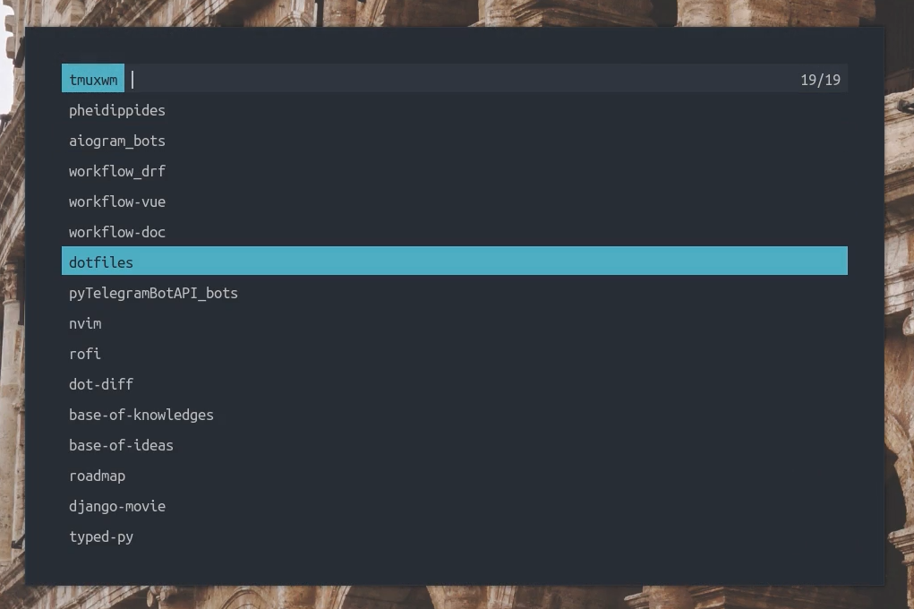
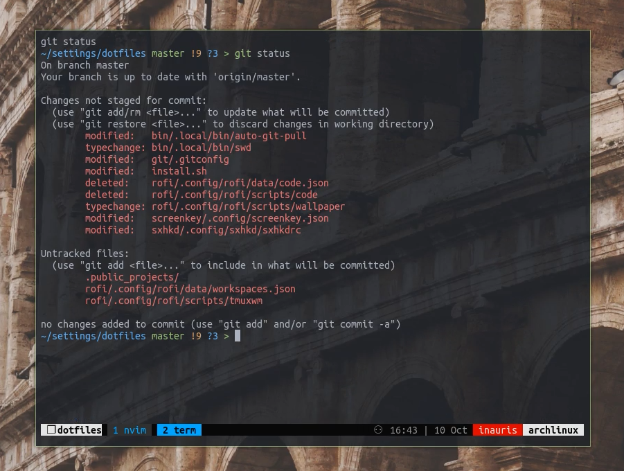
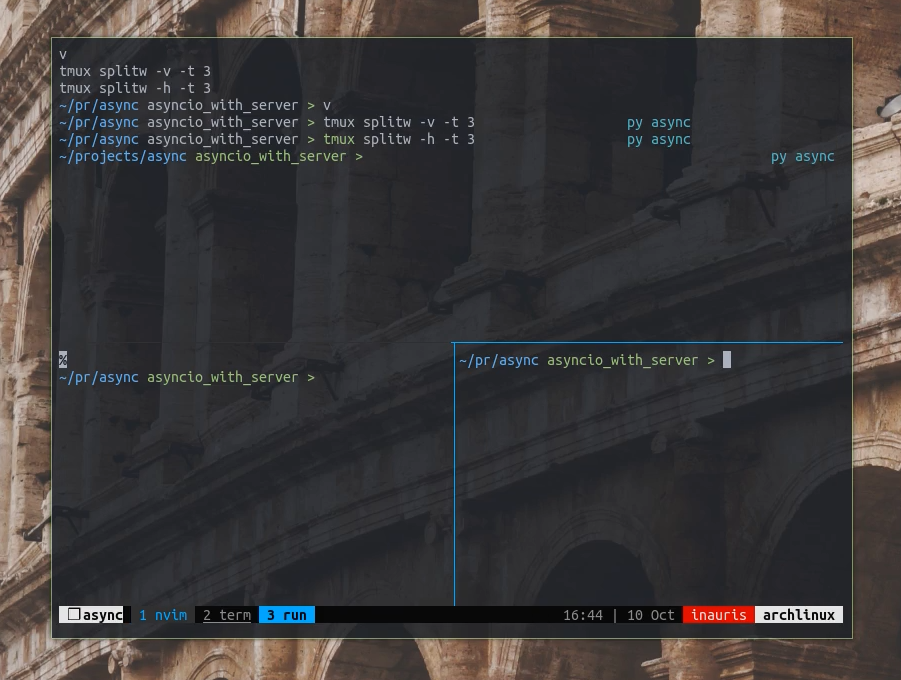

# Tmux workspace manager

This rofi-script allows you to start saved workspaces instantly

You can fill your workspaces!

| Rofi list of workspaces                |
|----------------------------------------|
|  |

| Example 1: Opened dotfiles workspace     | Example 2: Opened async workspace     |
|------------------------------------------|---------------------------------------|
|  |  |


## Instalation
- Clone repository & open directory
  ```
  git clone https://github.com/linux-mastery/tmux-workspace-manager.git
  cd tmux-workspace-manager
  ```
- Create a symlink to the `tmuxwm.sh` script & `workspaces.json`:
  ```
  # Create directories if they don't exist or select custom location and change paths
  ln -sf ./tmuxwm.sh ~/.config/rofi/scripts/tmuxwm.sh
  ln -sf ./workspaces.json ~/.config/rofi/data/workspaces.json
  ```
- Change path to your `workspaces.json` on 10 line in `./tmuxwm.sh`:
  ```
  data="/home/user/.config/rofi/data/workspaces.json"
  ```
- Then fill `workspaces.json` with your workspaces.
(You can see examples in the file)
- Finally everything is ready, you can run the script!

## Usage
To start it, run the file:
```
./tmuxwm.sh
```
Or setup your own hotkey and run it!

## Requirements
- `rofi`
- `tmux`
- `xkb-switch`: for automatic language change to English
